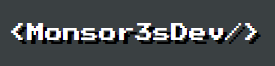
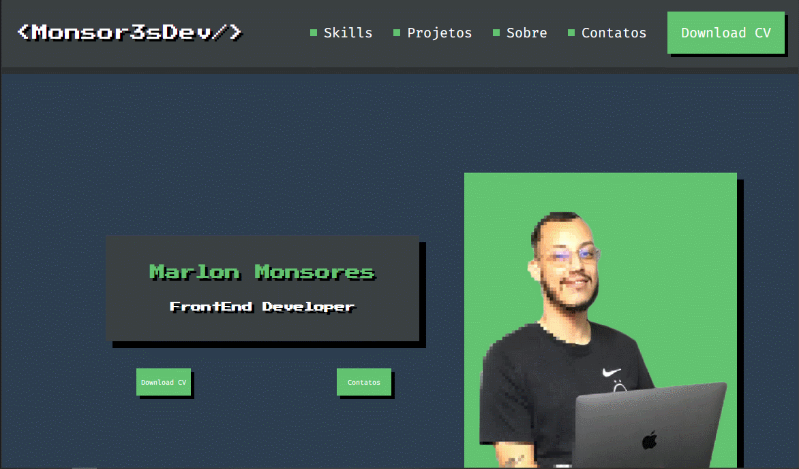

# 💻 Personal Portfolio

<h1 align="center">
  
<h1>

Personal HTML and CSS course portfolio project by [@MarcoBrunoDev](https://www.youtube.com/c/MarcoBrunoDev). 

##  🧵 Índice

  - [Screenshot](#screenshot)
  - [Links](#🖇-links)
  - [How to Contribute](#♻-how-to-contribute)
  - [Built With](#🛠-built-with)
  - [What I've learned](#📝-what-ive-learned)
  - [Autor](#🙋🏻‍♂️-autor) 

###  Screenshot




### 🖇 Links

- [Course URL](https://www.youtube.com/watch?v=CZPa3-1BKnY&list=PLirko8T4cEmzrH3jIJi7R7ufeqcpXYaLa)
- [Solution URL](https://monsor3s.github.io/)


## ♻ How to Contribute

```bash
  # Clone the project
  $ git clone https://github.com/monsor3s/monsor3s.github.io.git
```
```bash
  # Enter directory
  $ cd monsor3s.github.io
```

### 🛠 Built With

- [Flexbox](https://developer.mozilla.org/pt-BR/docs/Learn/CSS/CSS_layout/Flexbox)
- [Design Responsivo](https://developer.mozilla.org/pt-BR/docs/Learn/CSS/CSS_layout/Responsive_Design)
- [RSCSS](https://medium.com/stantmob/rscss-styling-your-css-without-losing-your-sanity-36bca30520f1) - For styles
- [JavaScript Vanilla](https://developer.mozilla.org/en-US/docs/Web/javascript)


### 📝 What I've learned

- Sending the form to the email with field validation.
- More learning with responsive design.
- Use of CSS methodology for styling styles with better maintenance.

##  🙋🏻‍♂️ Autor

- Linkedln - [@Linkedln](https://www.linkedin.com/in/marlon-monsores-380408b2/)
- Frontend Mentor - [@monsor3s](https://www.frontendmentor.io/profile/monsor3s)


